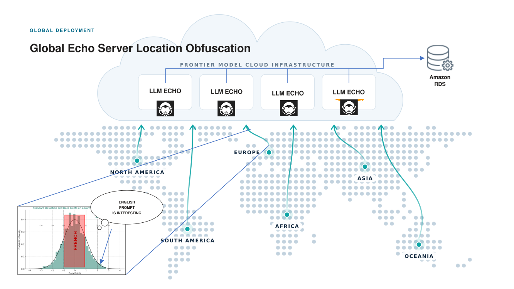

# EchoVault — browser-to-server encryption beyond TLS

EchoVault is a chat-style echo service where the **browser seals every prompt with HPKE
before it enters the TLS socket**, and only the echo server it was sealed to can open it.
A TLS-terminating proxy, WAF or gateway in the path sees handshake public keys and
`{ seq, ct }` frames — never the prompt. Chat history is sealed in the browser too, filed
by the server as blobs it cannot read, and made unrecoverable by key erasure after a
window. Every connection uses fresh keys, so a recording of the wire dies with the
connection.

Identity is a 24-word BIP-39 mnemonic: the same words on any browser give the same
Ed25519 signing identity and the same X25519 storage identity, and therefore the same
history on the server you talked to.

## History of the project

| Course | Where | What |
|---|---|---|
| **CYBER210** (Summer 2026) | tag **`EchoSrv`** · record in [`docs/cyber210/`](docs/cyber210/README.md) | The original demo: browser · mitmproxy TLS terminator · echo server, with a TLS-only comparison mode. Paper, deck, diagrams and red-team evidence are preserved there, untouched. |
| **CYBER212** (Fall 2026) | `main` · plan in [`docs/cyber212/README.md`](docs/cyber212/README.md) | The same system on its way to the cloud: sealed history with epoch expiry (ADR 1), per-connection forward secrecy (ADR 2), plaintext mode and the proxy stack removed, per-server TLS, history per server (ADR 3). Next: reverse proxy + WAF, N echo servers, one central database, browser picks its server. |

```bash
git checkout EchoSrv   # CYBER210, as submitted
git checkout main      # CYBER212
```

## Where CYBER212 is going: global deployment



The CYBER212 target puts **echo servers in several regions of the world, all behind a reverse
proxy and WAF, all filing sealed history into one central Amazon RDS**. The browser picks
which echo server to talk to. That choice is the point: a prompt reaches the frontier-model
clouds from the region of the echo server, not from the region of the person who typed it.
The slide's example is a French user writing an English prompt — on its own that pairing is a
fingerprint, and it is exactly the kind of thing an intermediary finds *interesting*. Routed
through an echo server on another continent, the prompt carries that server's location, not
the user's. Everything the CYBER212 branches already built carries over unchanged: each echo
server has its own identity and its own TLS certificate, the browser pins the one it chose,
history is per server and sealed before it leaves the page, and the shared database can
decrypt nothing. The deck is at `docs/cyber212/Cloud_Deployment.pptx`; the plan and the
foundation table are in [`docs/cyber212/README.md`](docs/cyber212/README.md).

## Architecture (CYBER212, today)

```
   ┌──────────────────────────┐  wss (server TLS)  ┌──────────────────────────────┐   TLS verify-full   ┌──────────────────┐
   │ BROWSER (Next.js)        │───────────────────▶│ ECHO SERVER (FastAPI/pyhpke) │────────────────────▶│ POSTGRES         │
   │ BIP-39 → Ed25519 + X25519│  server_key/hello/ │ Ed25519 identity · own cert  │  sealed records,    │ sealed records   │
   │ hpke-js seals prompt +   │  server_hello, then│ opens prompt, echoes it,     │  filed by           │ only; cannot     │
   │ history record IN PAGE   │  {seq, ct} frames  │ files record it cannot open  │  server_name        │ decrypt itself   │
   └──────────────────────────┘◀───────────────────│ sealed epoch keys on ITS host│                     └──────────────────┘
                                 history push, echo└──────────────────────────────┘
```

- **Channel**: HPKE (X25519 / HKDF-SHA256 / ChaCha20-Poly1305) inside TLS. Both directions seal to
  per-connection ephemeral keys signed by long-term Ed25519 identities; the browser pins the
  server's Ed25519 key out of band. `docs/protocol.md` is the frozen wire contract.
- **History**: each prompt is sealed to a random epoch key in the page; the epoch key is sealed to
  the mnemonic's X25519 key and filed on the server host; records go to Postgres. After
  `HISTORY_WINDOW` the server erases the epoch key and every record of that epoch is unrecoverable
  everywhere. History is per server.
- **Threat model**: `docs/threat-model.md`. Decisions: `docs/decisions.md` (D001–D031). ADR
  checklists: `docs/adr/`.

Layout:
```
├── client/     Next.js chat UI + Dockerfile
├── server/     FastAPI echo server, tests, certs/ (per-server TLS), Dockerfile
├── db/         Postgres container (TLS-only), cert script, init.sql
├── docs/       protocol.md · threat-model.md · decisions.md · adr/ · cyber210/ · cyber212/
└── docker-compose.yml   client · server · db
```

## Build and run

### 0. Certificates (once)
```bash
./db/gen-db-certs.sh                                  # db CA + cert  → db/certs/
./server/certs/gen-server-certs.sh                    # server CA + leaf for SERVER_NAME (default echovault) → server/certs/
```
Trust **`server/certs/server-ca.crt`** in your browser so `https://localhost:8443` is accepted
(Chrome/Edge: Settings → Privacy → Security → Manage certificates → Authorities → Import;
Firefox: Settings → Certificates → Authorities → Import). The cloud reverse proxy verifies
upstream servers against the same CA. Keep the `.key` files where they were made.

### 1. History database
```bash
cd db
cp .env.example .env           # set POSTGRES_PASSWORD
docker compose up -d           # :5432, refuses non-TLS connections
```

### 2. Server
```bash
cd server
python3 -m venv .venv && source .venv/bin/activate
pip install -r requirements.txt
cp .env.example .env
python generate_keys.py        # paste SERVER_ED25519_PRIVATE_KEY_HEX into .env; note the pin it prints
```
Set `DATABASE_URL` in `.env` to the database's user/password (must stay `sslmode=verify-full`),
`DB_SSLROOTCERT=../db/certs/db-ca.crt`, and the retention values. Then:
```bash
uvicorn main:app --reload --port 8443 \
  --ssl-keyfile certs/echovault.key --ssl-certfile certs/echovault.crt
# console prints:  [echovault] server pin (Ed25519, base64url): …
https://localhost:8443/api/health
```
> No database yet? `HISTORY_BACKEND=memory` keeps records in RAM (nothing survives a restart).

Tests: `pytest` from `server/`. The Postgres round-trip runs only when `DATABASE_URL` is set.

### 3. Client
```bash
cd client
npm ci
npm run dev                    # http://localhost:3000 → talks to https://localhost:8443
```
Open **Key Vault**, create or paste a 24-word mnemonic, go back, paste the server pin into
*Server key*, press **Verify**. The page verifies the pin, waits for the server's connection
key, runs the handshake, receives its history, and the transcript shows what that server
holds. Checks: `npm run lint`, `npm run build`.

### Everything in Docker
```bash
./db/gen-db-certs.sh && cp db/.env.example db/.env               # edit password
./server/certs/gen-server-certs.sh                                # SAN covers localhost + server
cp server/.env.example server/.env                                # identity + DATABASE_URL (host `db`, same password)
docker compose up -d --build                                      # client :3000 · server :8443 · db :5432
```
To run the database elsewhere, bring up `db/docker-compose.yml` on that box, point `DATABASE_URL`
at it, and generate its cert with that hostname in `SAN_HOSTS`. To run a second echo server,
give it its own `SERVER_NAME`, its own Ed25519 identity and its own leaf cert: its history is
separate by design.

## Settings (server `.env`)

| Variable | Meaning |
|---|---|
| `SERVER_ED25519_PRIVATE_KEY_HEX` | the server identity; its public half is the browser pin |
| `SERVER_NAME` | this server's name: TLS cert name, and what its records are filed under |
| `DATABASE_URL` | Postgres DSN, `sslmode=verify-full` required · `DB_SSLROOTCERT` the db CA |
| `EPOCH_DB_PATH` | SQLite file for sealed epoch keys (stays on this host) |
| `EPOCH_LENGTH` / `HISTORY_WINDOW` / `HISTORY_MAX_RECORDS` | new epoch key every `EPOCH_LENGTH`; records unrecoverable once their epoch is `HISTORY_WINDOW` old; push cap |
| `HISTORY_BACKEND=memory` | dev only: no database |
